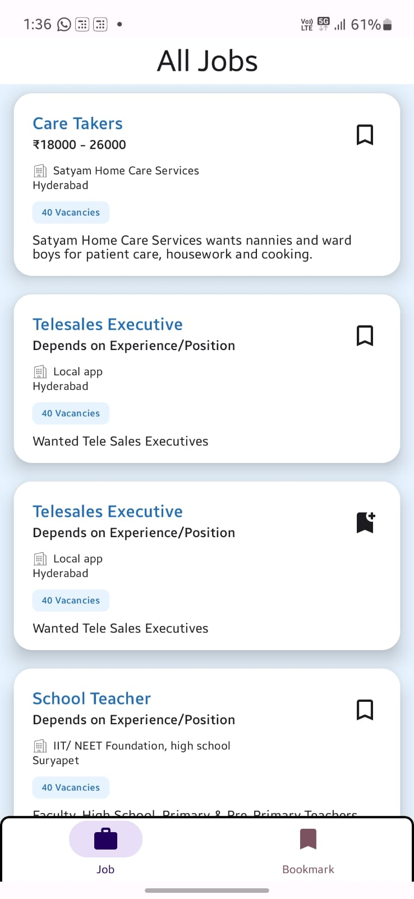
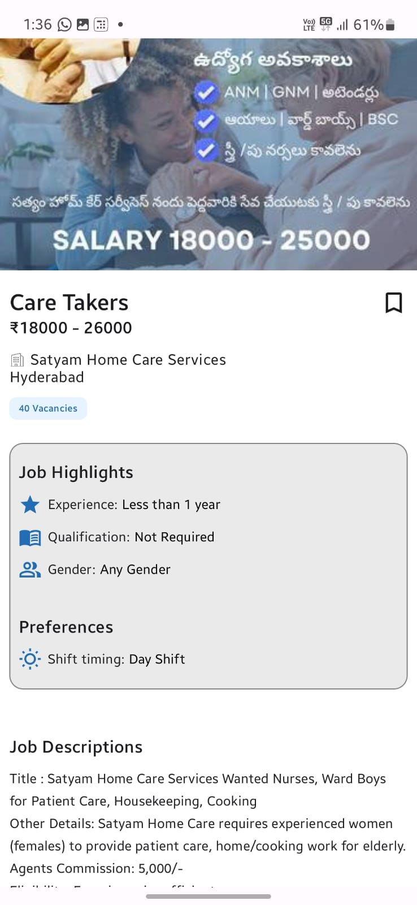
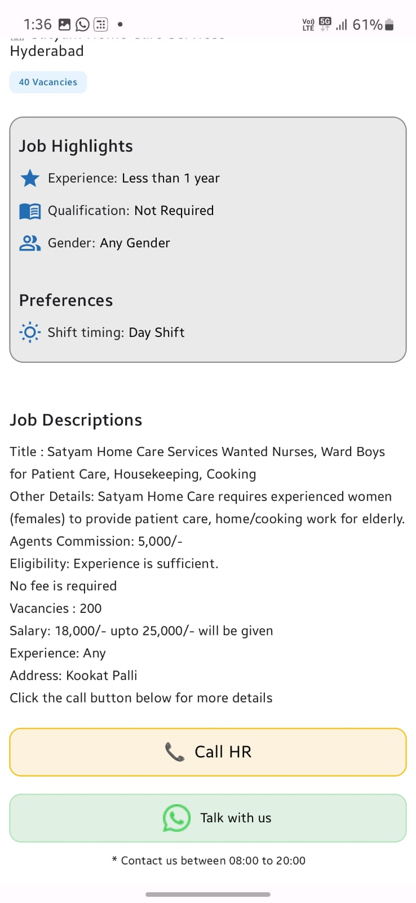
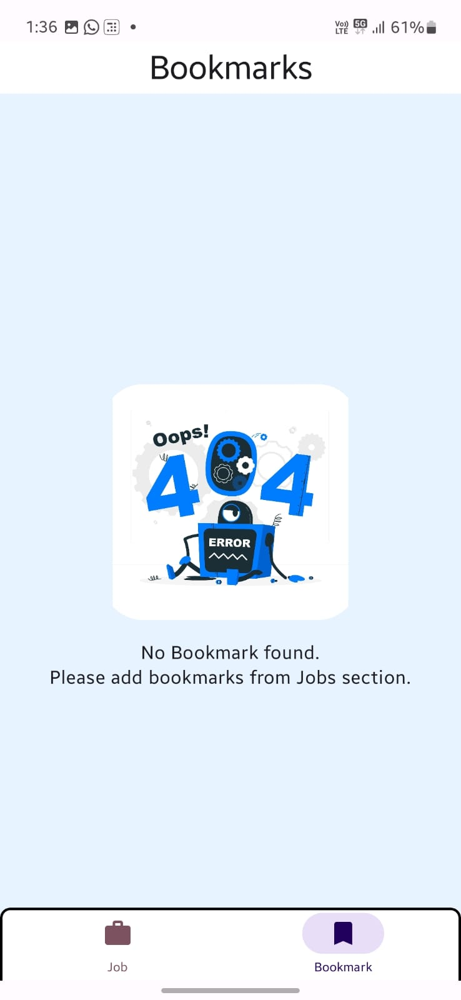
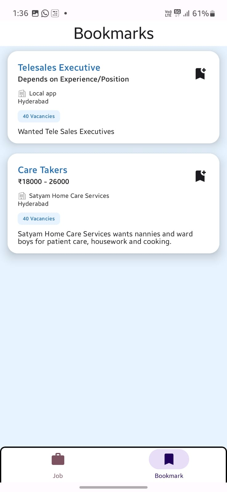

# Lokal Jobs Assignment
This project is an Android application built using Kotlin, Jetpack Compose, and various modern Android libraries. The app is designed with a focus on clean architecture, leveraging MVVM, state management, and robust network handling through sealed classes. Below, you'll find a detailed overview of the app, its key components, features, and media showcasing its functionality.

## Features

- **Job Listing:** Display a list of job postings fetched from a remote API.
- **Pagination:** Automatically load more jobs as the user scrolls down.
- **Job Details:** View detailed information about each job, including location, salary, and contact information.
- **Bookmark Jobs:** Bookmark jobs for later viewing, even when offline.
- **Offline Support:** Bookmarked jobs are stored locally, allowing offline access.
- **Error Handling:** User-friendly error messages and retry options when network issues occur.
- **Loading States:** Smooth loading animations while data is being fetched.

## Tech Stack

- **Kotlin & Jetpack Compose:** Used for building the UI and managing UI states efficiently.
- **Dagger-Hilt:** Dependency injection framework for providing dependencies across the app.
- **Flow & Coroutines:** Handle asynchronous data streams and manage background tasks.
- **Room Database:** Manage local data storage, specifically for storing bookmarked jobs.
- **Navigation Graph:** Manages in-app navigation with a single activity architecture.
- **Retrofit & OkHttp:** Handle network requests and responses, including parsing JSON data with GsonConverterFactory.

## Screenshots

<table>
  <tr>
    <td></td>
    <td></td>
    <td></td> 
  </tr>
  <tr>
   <td></td>
    <td></td>
  </tr>
</table>

## Video

<video controls src="https://res.cloudinary.com/djwqr0hgq/video/upload/v1743847170/o9psgqhmefiowcxhsiqb.mp4" title="videos/Demo.mp4"></video>

## Made By

This project is developed by [Dalima Sahu](https://dalima2910.vercel.app) in submission of assignment for App Developer Intern at Lokal.

